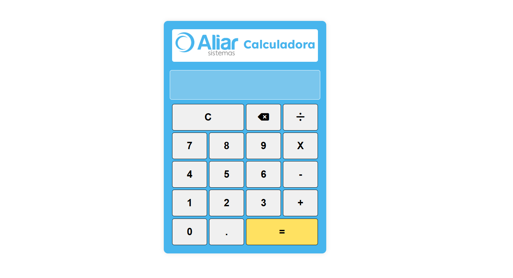

# Desafio - Calculadora

Este projeto foi desenvolvido como parte de um desafio de programação para a ALIAR SISTEMAS. A ideia foi criar uma calculadora simples com operações básicas como soma, subtração, multiplicação e divisão e outras funcionalidades.

## Funcionalidades

- Realizar operações de **adição**, **subtração**, **multiplicação** e **divisão**.
- Exibir o resultado de operações matemáticas.
- Funcionalidade de **limpar** a tela e **deletar o último caractere**.
- Interface interativa com **ícones** do Font Awesome, incluindo ícone de **backspace**.
- Layout responsivo e moderno, com centralização da calculadora na tela.

## Tecnologias Utilizadas

- **HTML**: Para a estrutura da página.
- **CSS**: Para estilização, utilizando um layout flexbox e grid para os botões.
- **JavaScript**: Para implementar a lógica da calculadora, com funções para adicionar números ao display, calcular o resultado, limpar e deletar.

## Como Executar

1. Clone o repositório para a sua máquina:

    ```bash
    git clone https://github.com/seu-usuario/calculadora.git
    ```

2. Navegue até a pasta do projeto:

    ```bash
    cd calculadora
    ```

3. Abra o arquivo `index.html` no seu navegador para ver a calculadora em funcionamento.

## Funcionalidades do Projeto

- **C**: Limpa a tela da calculadora.
- **DEL**: Deleta o último caractere inserido.
- **Operações**: Adiciona os números e as operações de soma, subtração, multiplicação e divisão.
- **=**: Calcula e exibe o resultado da operação.
  
## Demonstração



## Observações

- A calculadora foi feita para ser simples e funcional.
- Utilizei as cores de estilização do site da ALIAR SISTEMAS.
- Ela pode ser expandida futuramente com mais funcionalidades, como cálculos de porcentagem, raízes quadradas e outras operações matemáticas.


## Licença

Este projeto foi desenvolvido por Elane Alencar:

[Portfólio] (https://portfolio-elanealencar.vercel.app/)

[Linkedin] (https://linkedin.com/in/elanealencar/)